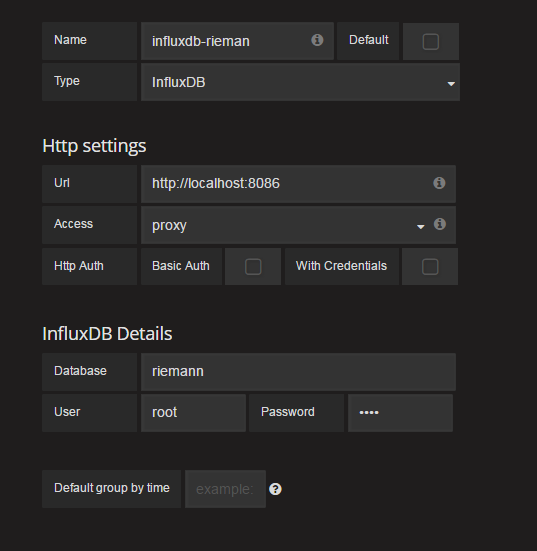
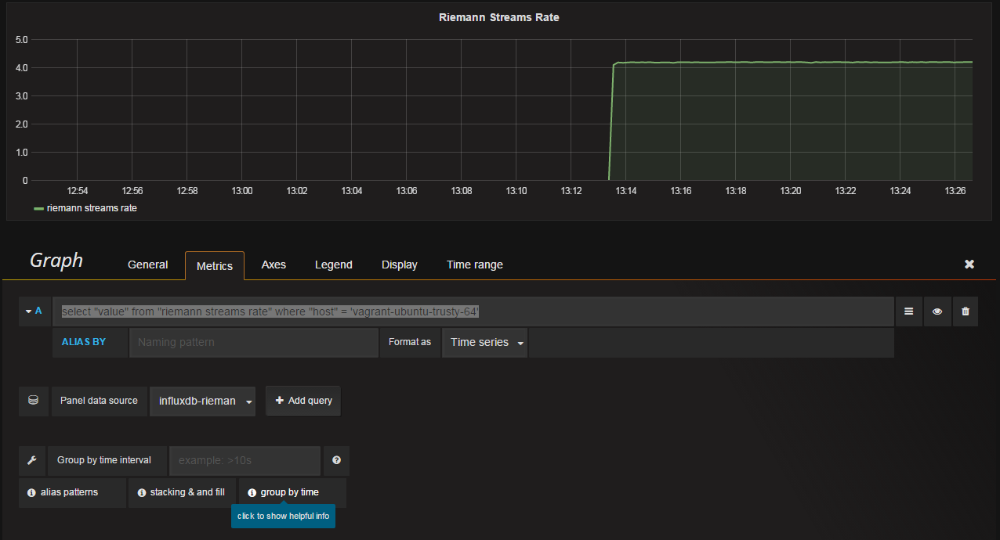

# Riemann-InfluxDB-Grafana

## Pre-Requisite

1. Java >= 1.7
2. Riemann 2.11
3. InfluxDB
4. Grafana


## Description

* In order to forward the Riemann events to AWS SNS Topic, Riemann provides  `(influxdb {})` function.

## Usage


### Reimann

* Seperate functions of credentials and batching will enable the sending of data from Riemann to InfluxDB

```
(def influxdb-creds {   :version :0.9
                        :host "172.28.128.5"
                        :username "root"
                        :password "root"
                        :port 8086
                        :db "riemann"})

(def influxSender
  (batch 100 1/10
         (async-queue! :agg {:queue-size 1000
                             :core-pool-size 1
                             :max-pool-size 4
                             :keep-alive-time 60000}
                       (influxdb influxdb-creds))))

```

### Influx

* Create database in Influx as per following query:

`CREATE DATABASE riemann`

### Grafana

* Link the `riemann` database from Influx to Grafana as per following screen.



* Create a graph pane with the following query

`select "value" from "riemann streams rate" where "host" = 'vagrant-ubuntu-trusty-64'`


